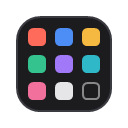
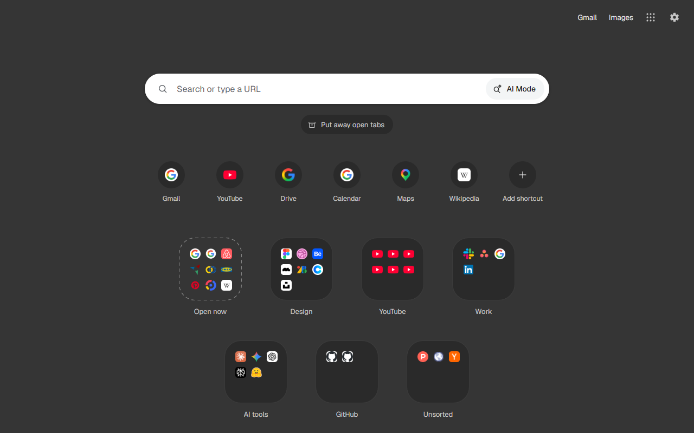

#  Foldaway

**Hoard tabs, guilt-free.** A Chrome extension that turns your new tab page into a calm place: a
search bar, your shortcuts, and folders where you put your open tabs away. One click puts them
away; another brings any of them back.

- No account, no server, no tracking: your folders stay on your computer (and in your Chrome
  bookmarks, if you turn on the copy there).
  Read the [privacy policy](PRIVACY.md).
- Questions or problems? [Open an issue](https://github.com/victorirtwange/victorirtwange.github.io/issues).

© 2026 Victor Irtwange
